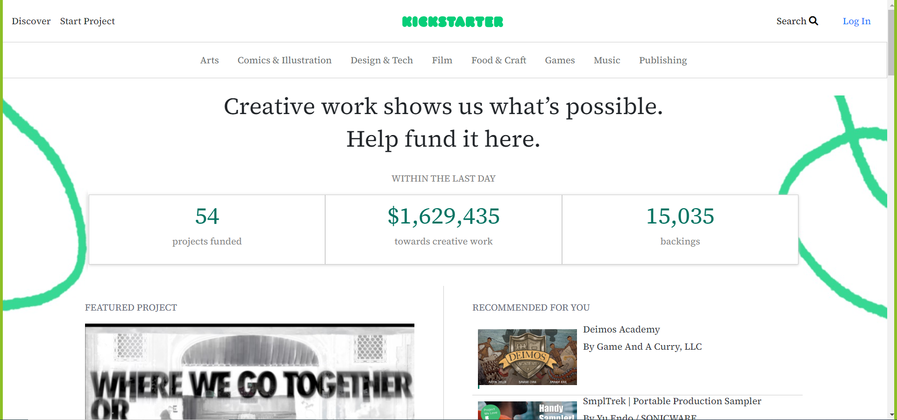
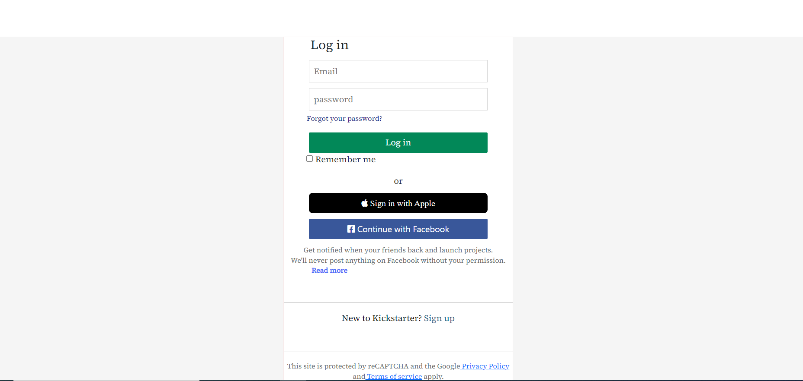
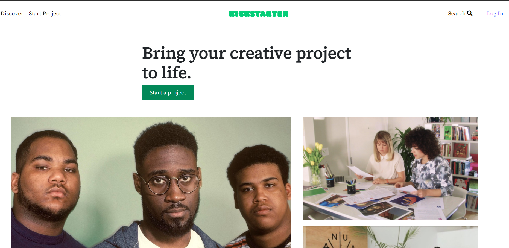
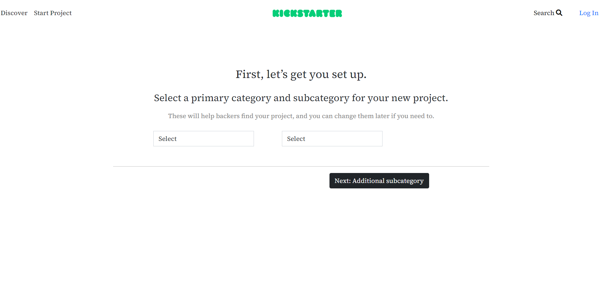
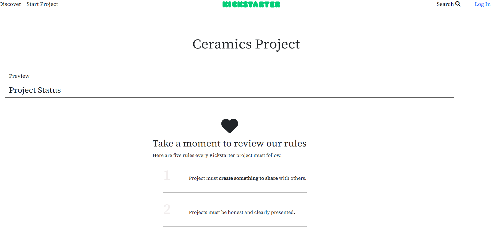
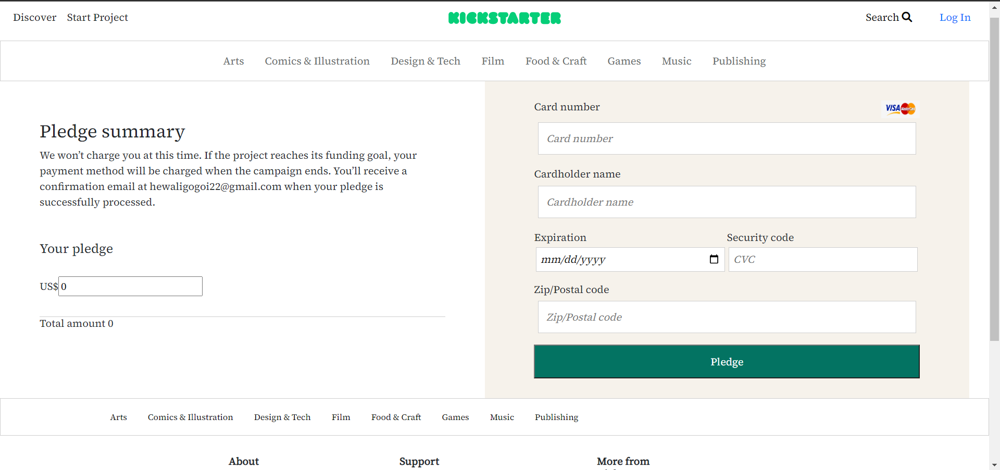

# Kickstarter - (Clone)

This is a clone of Kickstarter which is an American public benefit corporation based in Brooklyn, New York, that maintains a global crowdfunding platform focused on creativity. Technologies such as React/Redux and Styled components are used.

# Tech Stack Used 💻

- ReactJS
- Redux
- Styled-components
- Material UI

## How to run the project 🚀

Please fork the repository and then use it on your own.

You can also take a glimpse of our Project, just follow the below steps:

1. Run the command npm run start in terminal to start the app at port 3000.

2. Go to the browser you will land on the home page.

## Snapshots 📷

1. Home Page

2. Login page

3. Start a project page

4. Select category page

5. Project status Page

5. Payment Page

## Features ✨
- We have added Login and signup pages using react-redux    libarary.
- You can raise the funds for your creative projects.
- Added Logout functionality.
- You can help to others by make a payment for their creative projects.

## Demo 🎥

Deployed Link: [Kickstarter Clone](https://apna-kickstarter.netlify.app/)

## Team Members and Contributors 😇

👤 Sumitra Awadhiya
- Github : [Sumitra Awadhiya](https://github.com/sumitra05)

👤 Hewali Gogoi
- Github : [Hewali Gogoi](https://github.com/HewaliGogoi)

👤 Amarjeet Maurya
- Github : [Amarjeet Maurya](https://github.com/amar969)